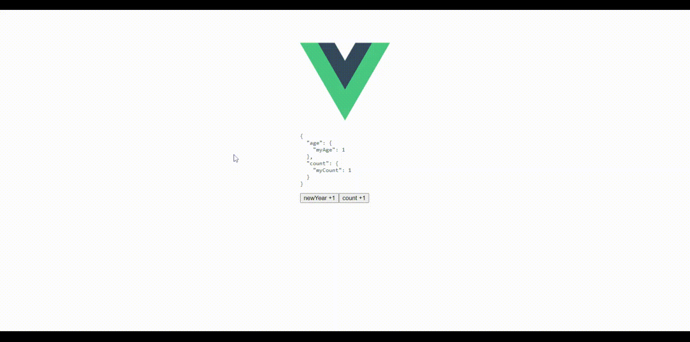

# tstore-vue3ts




## NPM install
```
npm i tstore-vue3ts
```
## Use
```typescript
import TStore, { importState } from '../tstore-vue3ts';

//interface.ts
//1. declare my module
interface IAge {
    myAge: number;
    newyear(): void;
}

interface ICount {
    myCount: number
    add(n: number): void;
}

//2. declare type state
export type MyState = { age: IAge } & { count: ICount };


///3. file data store
export const count: ICount = {
    myCount: 1,
    add(n: number) {
        this.myCount += n;
    }
}

//import one data to state.
//importState({ count });

export const age: IAge = {
    myAge: 1,
    newyear() {
        this.myAge++;
    }
};

//import one data to state.
//importState({ age });

//4. import mutil data to state.
importState({ age }, { count });


/// store.ts
export function useAppStore(): MyState {
    return mystate.useTStore();
}
const mystate = new TStore<MyState>();
export default mystate;

//5. use in component
const store = useAppStore();
store.age.myAge++
store.age.newyear()
```

## Project setup
```
npm install
```

### Compiles and hot-reloads for development
```
npm run serve
```

### Compiles and minifies for production
```
npm run build
```

### Lints and fixes files
```
npm run lint
```

### Customize configuration
See [Configuration Reference](https://cli.vuejs.org/config/).
